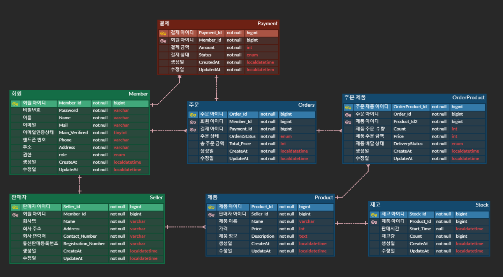
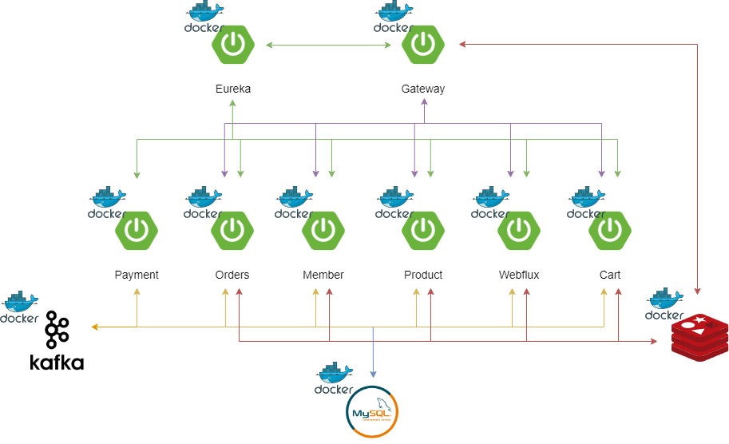
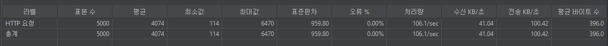

<h2> 목차 </h2>

- [기술 스택](#기술-스택)
- [ERD](#ERD)
- [API 명세](#api-명세)
- [주요 기능](#주요-기능)
- [아키텍처](#아키텍처)
- [기술적 의사 결정](#기술적-의사-결정)
- [성능 개선](#성능-개선)
- [트러블 슈팅](#트러블-슈팅)

---

<h3> 프로젝트 소개  </h3>

- 사용자가 다양한 굿즈를 한 곳에서 검색 구입이 가능하며 한정판 굿즈를 선착순으로 구매할 수 있고 누구든 판매자 등록을 통해 자신이 제작한 굿즈를 판매할 수 있는 서비스를 제공하는 굿즈 이커머스 프로젝트입니다.

<h3 id="기술-스택"> 기술 스택 </h3>

    
    
    
    
    
    
    
    

<h3 id="ERD"> ERD </h3>

<h3 id="api-명세"> API 명세 </h3>

[API 명세서](https://documenter.getpostman.com/view/11696446/2sA3kSo3FV)

<h3 id="주요-기능"> 주요 기능 </h3>

    
장바구니

    

- 사용자가 원하는 제품을 장바구니에 담거나, 담은 물건을 수정 및 삭제할 수 있으며, 변경된 날로부터 7일 동안 유지됩니다.

 
    
 선착순 구매 
 
    

- 특정 시간부터 주문할 수 있도록 구현했으며 이벤트 기반으로 진행되고 실패 시 보상 트랜잭션을 통해 자동으로 재고를 복구합니다.

 
    
 실시간 재고 확인 

    

- 제품 ID를 통해 서버와 SSE 통신을 설정해 사용자가 실시간으로 재고 상태를 모니터링할 수 있는 기능입니다.

<h3 id="아키텍처"> 아키텍처 </h3>

---

<h3 id="성능-개선"> 성능 개선 </h3>

<b> 재고 관리 </b>

초기 상태에서는 모든 재고 조회 및 갱신 작업이 데이터베이스에 직접 접근하는 방식으로 이루어졌습니다. 
이로 인해 많은 부하가 발생하고 응답 시간이 길어져 개선이 필요하다고 느꼈고 
성능을 최적화하기 위해 캐싱과 Lua 스크립트를 사용하여 재고 처리를 개선했습니다.

성능 개선 단계 (Jmeter 500개 쓰레드, 10번의 루프 테스트)

- 캐싱 적용 전
  
- 캐싱 적용, Redis를 사용하여 재고 데이터를 캐싱함으로써 데이터베이스 조회 빈도를 줄임
- <b> 평균 응답 시간 52.7% 개선 </b>
  
- 캐싱 적용 및 Lua 스크립트를 사용, 원자적처리 및 네트워크 왕복 시간을 줄임
- <b> 평균 응답 시간 73.2% 개선 </b>
  
  

---

<h3 id="기술적-의사-결정"> 기술적 의사 결정 </h3>

<b> Message Driven과 Event Driven </b>

- 이커머스 프로젝트를 진행하며 Event Driven Architecture 를 적용했는데 그 이유로는
    - Message Driven은 동기식 통신을 기반으로 하기 때문에 요청에 대한 응답이 오기전까지 대기하고 있어야 하기 때문에 전체적인 응답시간이 길어질 수 있는 반면 Event Driven은 이벤트 기반
      비동기 통신을 사용할 수 있기에 여러 작업들을 동시에 처리할 수 있어 전체적 응답 속도를 높일 수 있습니다.
    - Message Driven은 서비스들간에 강한 결합이 생길 수 있습니다. 강한 결합이 생길 경우 유지 보수성과 확장성이 떨어지게 되는 반면 Event Driven의 경우 이벤트 Pub/Sub을 통해 서비스
      로직을 실행하기 때문에 각 서비스 간의 결합도를 낮춰 Message Driven에 비해 높은 확장성과 더 나은 유지 보수성을 가질 수 있습니다.
- 결론적으로 이커머스 프로젝트는 사용자에게 빠르게 반응해야 하며 높은 확장성과 유연성이 필요한데 이런 요구사항을 충족시키기 위해 Message Driven Architecture보다 Event Driven
  Architecture가 더 적합하다고 판단하여 선택했습니다.

<b>재고 캐싱 전략 </b>

- 성능 개선을 위해 재고를 캐싱하는 방법을 선택했고, 그에 따른 전략들을 찾아본 후 읽기 전략으로는 Look Aside, 쓰기 전략 Write Through을 선택해서 구현했습니다.
    - Read Through 패턴은 데이터 정합성에는 문제가 없으나 캐시 서버가 다운될 경우 서비스 전체가 중단될 수 있는 단점이 있었고 Look Aside 패턴은 캐시 서버가 다운되더라도 서비스가 중단되지
      않으며, 데이터베이스 트래픽을 효과적으로 줄일 수 있다고 생각했습니다.
    - Write Back 패턴은 데이터베이스 부하를 줄일 수 있지만 캐시 서버가 다운되면 데이터를 영구적으로 소실할 수 있는 위험이 있었고 Write Around 패턴은 데이터가 수정될 때 캐시가 갱신되지 않아
      데이터 정합성 문제가 발생할 수 있는 문제점이 있었습니다. Write Through 패턴은 다른 패턴보다 조금 느리더라도 데이터 일관성을 유지할 수 있고 캐시와 DB의 데이터 정합성을 보장할 수 있다는
      점이 중요하다고 생각했습니다.
- 결국 이커머스 프로젝트에서는 데이터의 정합성과 일관성이 무엇보다 중요하다고 판단했고 잘못된 재고 정보로 인해 판매가 중단되거나 과도한 판매가 발생할 경우 서비스에 큰 영향을 미칠 수 있기 때문에 이러한 결정을
  하게 됐습니다.

---

<h3 id="트러블-슈팅"> 트러블 슈팅 </h3>

동시성 이슈

- 서비스 로직 테스트 시 100개의 재고보다 과도하게 판매되는 상황 발생

문제 해결 방법 모색

Lock을 구현해서 해결해야 했고, 아래의 락들을 간단하게 구현하고 테스트 해봤습니다.

- 자바 어플리케이션 수준의 락
- 데이터 베이스 수준의 락
- 분산 시스템 수준의 락

<b> 결론 </b>

- 현재 프로젝트는 분리된 여러 서비스들이 서로 상호작용하며 데이터의 일관성과 무결성을 유지해야하며 DB에 대한 부하도 줄여야함 -> 분산 락이 제일 적합할 것으로 판단
- Redis와 Zookeeper중 Zookeeper는 데이터 지속성이 있으나 설정과 운영이 복잡해질 수 있고 Redis의 경우 성능적으로 더 빠르며 초기 설정이 단순하고 운영의 복잡성을 줄일 수 있어  Redis의 Redisson을 이용해 분산 락 구현

- jmeter 500개 쓰레드로 한번에 요청한 결과
  
  
  
  

[자세한 내용 보기](https://velog.io/@malslapq/%EB%AC%BC%EA%B1%B4%EC%9D%B4-%EC%97%86%EB%8A%94%EB%8D%B0-%ED%8C%94%EB%A0%A4%EB%B2%84%EB%A0%B8%EB%8B%A4...-%EB%8F%99%EC%8B%9C%EC%84%B1-%EC%9D%B4%EC%8A%88)
