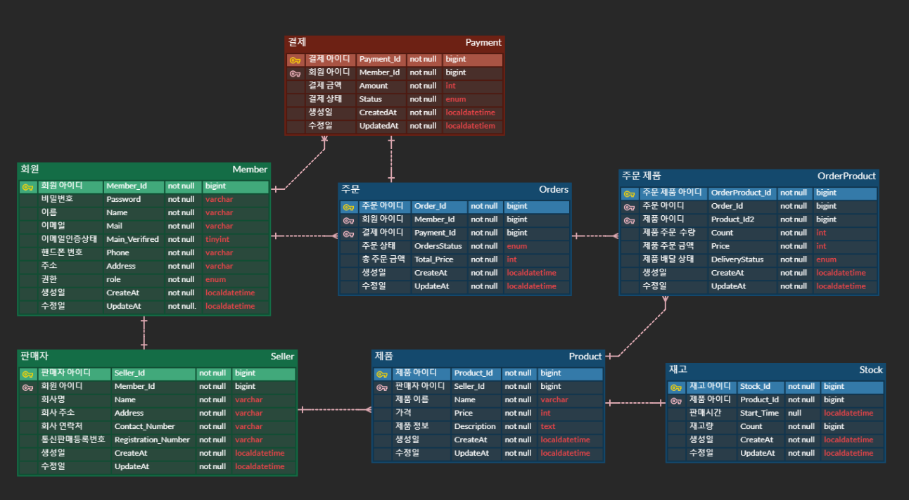
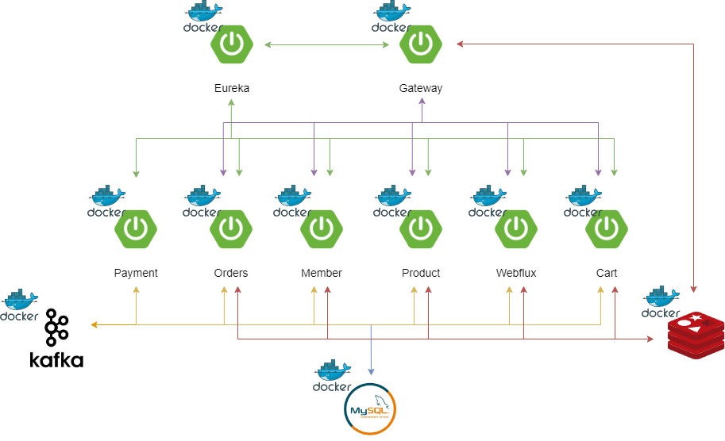

<h2> 목차 </h2>

- [기술 스택](#기술-스택)
- [ERD](#ERD)
- [API 명세](#api-명세)
- [주요 기능](#주요-기능)
- [아키텍처](#아키텍처)
- [기술적 의사 결정](#기술적-의사-결정)
- [트러블 슈팅](#트러블-슈팅)

---

<h3> 프로젝트 소개  </h3>

- 사용자가 다양한 굿즈를 한 곳에서 검색 구입이 가능하며 한정판 굿즈를 선착순으로 구매할 수 있고 누구든 판매자 등록을 통해 자신이 제작한 굿즈를 판매할 수 있는 서비스를 제공하는 굿즈 이커머스 프로젝트입니다.

<h3 id="기술-스택"> 기술 스택 </h3>

    
    
    
    
    
    
    
    
    

<h3 id="ERD"> ERD </h3>

<h3 id="api-명세"> API 명세 </h3>

[API 명세서](https://documenter.getpostman.com/view/11696446/2sA3kSo3FV)

<h3 id="주요-기능"> 주요 기능 </h3>

    
장바구니

    

- 사용자가 원하는 제품을 장바구니에 담거나, 담은 물건을 수정 및 삭제할 수 있으며, 변경된 날로부터 7일 동안 유지됩니다.

 
    
 선착순 구매 
 
    

- 특정 시간부터 주문할 수 있도록 구현했으며 이벤트 기반으로 진행되고 실패 시 보상 트랜잭션을 통해 자동으로 재고를 복구합니다.

 
    
 실시간 재고 확인 

    

-  제품 ID를 통해 서버와 SSE 통신을 설정해 사용자가 실시간으로 재고 상태를 모니터링할 수 있는 기능입니다.

<h3 id="아키텍처"> 아키텍처 </h3>

---

<h3 id="기술적-의사-결정"> 기술적 의사 결정 </h3>

Message Driven과 Event Driven

- 이커머스 프로젝트를 진행하며 Event Driven Architecture 를 적용했는데 그 이유로는 
  - Message Driven은 동기식 통신을 기반으로 하기 때문에 요청에 대한 응답이 오기전까지 대기하고 있어야 하기 때문에 전체적인 응답시간이 길어질 수 있는 반면 Event Driven은 이벤트 기반 비동기 통신을 사용할 수 있기에 여러 작업들을 동시에 처리할 수 있어 전체적 응답 속도를 높일 수 있습니다.
  - Message Driven은 서비스들간에 강한 결합이 생길 수 있습니다. 강한 결합이 생길 경우 유지 보수성과 확장성이 떨어지게 되는 반면 Event Driven의 경우 이벤트 Pub/Sub을 통해 서비스 로직을 실행하기 때문에 각 서비스 간의 결합도를 낮춰 Message Driven에 비해 높은 확장성과 더 나은 유지 보수성을 가질 수 있습니다.
- 결론적으로 이커머스 프로젝트는 사용자에게 빠르게 반응해야 하며 높은 확장성과 유연성이 필요한데 이런 요구사항을 충족시키기 위해 Message Driven Architecture보다 Event Driven Architecture가 더 적합하다고 판단하여 선택했습니다.

---

<h3 id="트러블-슈팅"> 트러블 슈팅 </h3>

 
    
 동시성 이슈 

- 재고 100개를 추가해놨는데 서비스 로직 테스트시 120개가 팔려버리는 상황 발생

**문제 해결 방법 모색**

자바 어플리케이션 수준의 락

1. synchronized
    - 메서드 또는 특정 블럭을 하나의 스레드만 접근해 실행할 수 있도록 하며 간단하게 동시성을 제어할 수 있으나 해당 작업이 길 경우 대기하는 스레드가 많아 성능 저하가 발생할 수 있음
2. ReentrantLock
    - 명시적으로 락을 획득하거나 락을 해제할 수 있어 더 정교하게 동시성을 제어할 수 있고 공정성 설정을 통해 큐와 같이 요청한 순서대로 실행되도록 할 수 있음
3. Atomic Variables
    - 락을 사용하지 않고 원자적으로 연산을 실행하고 데이터를 업데이트 하는데 만약 업데이트하려는 데이터의 초기 예상값과 업데이트 시 현재 값이 같다면 새로운 값으로 업데이트하고 다르다면 다시 연산을 시도하거나 exception을 발생시키는 로직을 작성할 수 있습니다. 하지만 많은 스레드가 동시에 연산을 시도하는 경우 성능 저하가 발생할 수 있음

데이터 베이스 수준의 락

1. 낙관적 락
    - 트랜잭션 충돌이 일어나지 않을 것이라고 예상하고 데이터를 수정하는 방식으로 컬럼을 하나 추가해 번호나 타임스탬프 값을 사용해 해당 데이터의 변경 여부를 확인하고 트랜잭션이 완료되기 전 데이터가 변경 됐는지를 확인 해 변경되지 않았을 경우 변경 트랜잭션이 완료되고 변경됐을 경우에는 롤백 또는 재시도를 한다.
    - 다만 낙관적 락은 충돌이 거의 없을 것이라고 예상하고 사용하는 것이기 때문에 실제로 충돌이 많이 일어날 경우 성능 저하는 물론 데이터의 일관성에도 문제가 발생할 수 있기에 현재 내 프로젝트에 적용하기에는 적합하지 않았다.
2. 비관적 락
    - 트랜잭션끼리 충돌이 많을 것이라 생각해 이를 미리 방지하는 방식으로 트랜잭션이 특정 데이터를 수정하기전에 락을 걸고 다른 트랜잭션들의 접근을 막는 방식이다.
    - 데이터의 무결성을 보장하고 트랜잭션 충돌이 일어날 가능성이 적지만 데드락이 일어날 가능성이 높고 락을 획득하려고 지속적으로 시도하기 때문에 대기하는 시간이 길어질수록 DB에 부하가 가기 때문에 주의해야 한다.

분산 시스템 수준의 락

1. 분산 락
    - 시스템 수준의 락으로 여러 노드 또는 스레드에서 동시에 자원에 접근하지 못하도록 락을 거는 방식으로 주로 Redis와 Zookeeper를 이용해 구현한다.
    - 수평적으로 확장하는데 유리하고 데드락을 분산락 알고리즘(pub/sub)을 이용해 데드락을 방지할 수 있다. 다만 분산 환경에서 분산락을 구현하는게 복잡하고 시스템 수준의 락이므로 네트워크 통신 오버헤드가 발생할 수 있다.

결론
- 현재 진행하고 이커머스 프로젝트에서는 분리된 여러 서비스들이 서로 상호작용하며 데이터의 일관성과 무결성을 유지해야 하고 DB에 대한 부하도 줄여야 하기 때문에 분산 락이 제일 적합할 것으로 생각했기 때문에 Redis 구현체인 Redisson의 분산락을 통해 동시성 문제를 해결했습니다.

